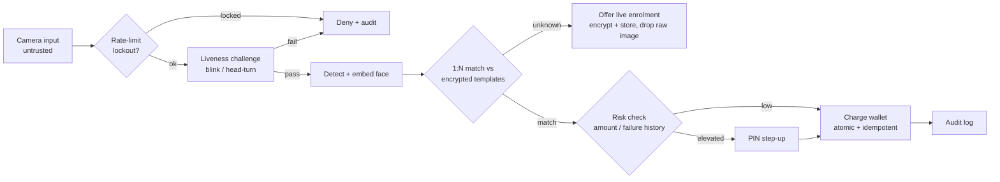

# FacePay

**A privacy-conscious biometric payment system** — authenticate by face, then authorise a
payment. Built to go *deep* on the hard problems: replay-resistant **liveness detection**,
**secure biometric-template handling**, and evidence-based **accuracy evaluation** — rather than
wide on surface features.

> One-line summary: *a biometric payment prototype focused on liveness (anti-spoofing),
> secure template storage, and the accuracy trade-offs of face recognition — not just "a
> face-recognition app."*

---

## Features

**Recognition**
- 1:N face identification from a live webcam (FaceNet512 embeddings, cosine matching)
- Unknown-face rejection at an evidence-tuned decision threshold
- Live multi-frame enrolment (no posed photos needed)

**Liveness / anti-spoofing**
- Randomised challenge–response — blink *and* head-turn, chosen at random
- Eye-Aspect-Ratio blink detection and head-pose yaw estimation
- Real-time face overlay (detection brackets) during every stage

**Security**
- Biometric templates encrypted at rest (Fernet/AES), key stored outside the database
- No raw-image retention — enrolment frames are embedded then deleted
- Separate identity and biometric tables
- Persisted rate limiting / lockout against hill-climbing attacks
- Risk-based step-up — PIN required on top of the face for high-value or suspicious payments (PSD2-style SCA)
- PINs hashed (PBKDF2), biometrics encrypted — the correct primitive for each
- Append-only audit log of enrolment and every authentication decision
- Written threat model (STRIDE + biometric-specific)

**Payments**
- Face-authorised payments from a simulated wallet
- Atomic, idempotent transfers in integer pence (no double-charges, no float errors)
- Customer + merchant accounts in a financial database separate from biometrics
- Transaction history and refunds via a CLI

**Evaluation**
- False-accept / false-reject / misidentification measured across thresholds on LFW

## What this project demonstrates

- **Computer vision & applied ML** — face detection, FaceNet512 embeddings, 1:N identification, and a from-evidence decision threshold (not a guessed constant).
- **Anti-spoofing / liveness** — challenge–response (blink + head-turn) using Eye-Aspect-Ratio and head-pose geometry, with randomised challenges to resist replay.
- **Security engineering** — a written threat model (STRIDE + biometric-specific), encrypted templates at rest, rate limiting against hill-climbing, and an append-only audit log.
- **Data & privacy** — GDPR Article 9 ("special category") handling: data minimisation, no raw-image retention, right-to-erasure, key/data separation.
- **Evaluation methodology** — measured false-accept / false-reject / misidentification across thresholds on a public benchmark (LFW), and chose the operating point from the data.
- **Software engineering** — modular components, pinned dependencies, honest documentation, and a decision log capturing the *why* behind each choice.

## Architecture — the authentication flow



Liveness runs **first as a gate** — a spoof is rejected before any expensive recognition or
payment logic runs (defence in depth + efficiency).

## How it works

### 1. Recognition (evidence-based, not vibes)

A pre-trained network turns each face into a 512-dimensional **embedding**; same person → nearby
vectors, different people → far apart. Identification is a **1:N** search (the terminal doesn't
know who you are — it finds you among all enrolled users, the harder problem that distinguishes
"pay by face" from a 1:1 phone unlock). The accept/reject line is a **cosine-distance threshold
chosen from measured error rates** (see [Results](#results--evidence)).

### 2. Liveness (the anti-spoofing pillar)

A static photo can't blink and a flat image can't turn — so the system issues a **random**
on-demand challenge:

- **Blink** — detected via **Eye-Aspect-Ratio** (eye height ÷ width) crossing a calibrated threshold.
- **Head-turn** — detected via a **yaw** estimate (nose position relative to the eye midpoint).

Randomising the challenge *type, count, and direction* is what resists **replay** attacks: a
pre-recorded clip can't satisfy an unpredictable prompt in time. Reliability is bounded by frame
rate vs blink duration — a real finding documented in the decision log.

### 3. Security (the biometric-security pillar)

Anchored by a [threat model](THREAT-MODEL.md). Key controls:

- **Encrypted templates at rest** (Fernet/AES) — *not hashed*, because face matching is approximate; a hash can't be compared by distance. The key is stored **outside** the database.
- **No raw-image retention** — enrolment frames are embedded then **deleted**; only the encrypted vector is kept.
- **Store separation** — identity records and biometric templates live in separate tables.
- **Rate limiting** — persisted attempt-limiting/lockout to defeat **hill-climbing** (probing the similarity score toward acceptance); persisted so a restart can't reset it.
- **Append-only audit log** — enrolment and every auth decision, for non-repudiation.

### 4. Payment (correctness over features)

On a successful match, the face **authorises** a payment: the customer's wallet is debited and
the merchant's credited **atomically** (one DB transaction), **idempotently** (a retried request
charges once, via an idempotency key), with money as **integer pence** (never floats). Accounts
and balances live in a **separate database** from the biometric store. Refunds reverse a payment.
The full double-entry ledger (immutable entries, reconciliation, concurrency) is the next pillar.

## Results & evidence

**Threshold selection** — 30 genuine + 30 stranger images (LFW), false-accept vs false-reject
per threshold. For a payment system, false-accepts (and misidentification) are the costly errors,
so the chosen point is the *loosest threshold that still admits zero strangers*:

| Threshold | False reject | False accept | Misident. |
|-----------|-------------:|-------------:|----------:|
| 0.20 | 47% | 0% | 0 |
| **0.25 ✅** | **20%** | **0%** | **0** |
| 0.30 | 17% | 3% | 0 |
| 0.35 | 7% | 10% | 1 |
| 0.45 | 0% | 20% | 6 |

- **Live recognition:** after live enrolment, a genuine scan matches at **distance ≈ 0.05** — far inside the 0.25 threshold.
- **A key finding:** posed enrolment photos gave a genuine live distance of **0.36** (a false reject). The fix was *better enrolment* (live multi-frame capture), **not** loosening the threshold — improving enrolment↔inference match beats moving the line.
- **Liveness (tested):** a printed/phone photo fails the blink challenge — it cannot blink on demand. (Formal presentation-attack benchmarking per ISO/IEC 30107 is noted as future work.)

## Security controls → threats

A summary; the full analysis (assets, attacker profiles, STRIDE table, residual risks) is in
[THREAT-MODEL.md](THREAT-MODEL.md).

| Threat | Mitigation | Status |
|--------|-----------|:------:|
| Photo presentation | Blink liveness | ✅ |
| Replay / screen | Randomised challenge (type/count/direction) | ✅ |
| Stranger false-accept | Threshold tuned to 0% FAR on test set | ✅ |
| Misidentification (wrong account) | Gallery hygiene + threshold | ✅ |
| Template theft | Encryption at rest + key outside DB + no raw images | ✅ |
| Hill-climbing / probing | Persisted rate limit + lockout | ✅ |
| Repudiation | Append-only audit log | ✅ |
| Frame injection · 3-D masks · key rotation | — | ⏭️ future work |

## Prerequisites

| Requirement | Details |
| --- | --- |
| **Python** | 3.11 (developed on 3.11.9). Avoid 3.12+ — TensorFlow support lags. |
| **Webcam** | Required for liveness, scanning, and enrolment. |
| **Internet** | First run downloads models (FaceNet ~90 MB, MediaPipe landmarker ~4 MB) and, for evaluation, the LFW dataset (~200 MB). All cached. |
| **Disk** | ~500 MB for models + dataset. |
| **OS** | Cross-platform; developed on Windows 11. |

**Python packages** (pinned in `requirements.txt`): `deepface` (FaceNet512 embeddings) ·
`tensorflow` + `tf-keras` (backend) · `opencv-python` (capture, YuNet detector, drawing) ·
`mediapipe` (liveness landmarks) · `numpy` · `scikit-learn` (LFW, evaluation) ·
`cryptography` (template encryption).

## Installation

```bash
# 1. Clone
git clone https://github.com/eugenia-cnl-lee/facepay.git
cd facepay

# 2. Virtual environment (Windows PowerShell)
python -m venv .venv
.\.venv\Scripts\Activate.ps1     # macOS/Linux: source .venv/bin/activate

# 3. Dependencies
pip install -r requirements.txt
```

## Usage

**The full app** — rate-limit gate → liveness → identify → enrol if new → simulated payment:

```bash
python facepay.py
```

First run has an empty encrypted store, so you enrol yourself live; subsequent runs recognise you.

**Evaluate recognition accuracy** (downloads LFW on first run):

```bash
python build_dataset.py     # builds the evaluation gallery + test sets
python evaluate.py          # prints the FAR / FRR / misidentification table
```

**Try liveness on its own:**

```bash
python liveness.py          # random blink/head-turn challenge with a face overlay
```

**Inspect the audit trail:**

```bash
python -c "import audit; [print(r) for r in audit.recent()]"
```

**Wallet — balance, history, refund:**

```bash
python wallet.py balance eugenia
python wallet.py history eugenia
python wallet.py refund <payment_id>     # payment id shown in history
```

## Project structure

| File | Purpose |
| --- | --- |
| `facepay.py` | End-to-end app: rate-limit → liveness → identify → live enrol → simulated payment |
| `recognition.py` | Embeddings, similarity matching, unknown-face rejection |
| `liveness.py` | Challenge–response liveness (blink + head-turn) and the face overlay |
| `template_store.py` | Encrypted SQLite store; separate identity / biometric tables |
| `wallet_store.py` | Accounts + wallet in a separate DB; atomic, idempotent, integer-money transfers + refunds |
| `wallet.py` | Wallet CLI — `balance` / `history` / `refund` subcommands |
| `rate_limit.py` | Persisted attempt-limiting / lockout (anti hill-climbing) |
| `audit.py` | Append-only audit log |
| `risk.py` | Risk engine — face-only vs step-up from amount + failure history |
| `pin_auth.py` | PIN step-up (hashed PBKDF2) — knowledge factor for high-risk payments |
| `build_dataset.py` | Builds the LFW evaluation gallery + genuine/stranger test sets |
| `evaluate.py` | FAR / FRR / misidentification across thresholds |
| `logging_setup.py` | Silences TensorFlow startup logs (imported before deepface) |
| `THREAT-MODEL.md` | Assets, attacker profiles, STRIDE + biometric threat table, residual risks |
| `DECISIONS.md` | Design-decision & rationale log (the *why* behind each choice) |

**Not committed** (git-ignored): the encrypted store `faces.db` and its key `facepay.key`
(biometric data + key never leave the machine), enrolment/test images, and transient captures.
The dataset is regenerated with `build_dataset.py`.

## Key engineering decisions

A few of the documented decisions (full log in [DECISIONS.md](DECISIONS.md)):

- **Local model over a cloud face API** — the deep pillars (secure templates, liveness, latency) need access to the raw embedding, which a hosted API hides.
- **Encrypt, don't hash, templates** — approximate matching makes hashing unusable; this is the core biometric-security nuance.
- **Separate the evaluation dataset from the production gallery** — after a live scan confidently misidentified the user as an enrolled public figure, because test data had been loaded into the live gallery. 1:N false-match risk scales with gallery size.
- **Detector choice is a latency/accuracy trade** — moved from a fast-but-weak detector to YuNet after the weak one caused misidentification and unreliable enrolment on live frames.

## Limitations & future work

Being explicit about where this breaks (see the threat model's residual-risk section):

- **Liveness is a 2-D proxy** — defeatable in principle by a rotated photo or high-quality replay; real robustness needs **3-D / depth-based** presentation-attack detection.
- **No frame-injection defence** — an attacker who bypasses the physical camera defeats liveness; needs hardware attestation.
- **Key management** — the encryption key sits in a local file; production needs an env var / OS keystore / KMS, plus **key rotation**.
- **Cancelable templates** — a revocable transform (so a stolen template can be reissued) is designed-for but not implemented.
- **Payment & ledger** — the wallet moves *simulated* money, but atomically, idempotently, and in integer pence. Real card rails and a proper **double-entry ledger** (immutable entries, reconciliation, concurrency) are the next pillar (Tier 5).
- **Latency** — deep-net inference runs on CPU; a systematic on-device-vs-cloud latency study is the natural next pillar.
